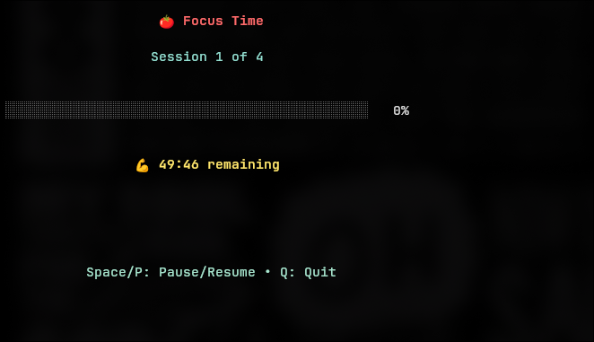

# 🍅 Pomodoro Timer

A beautiful, terminal-based Pomodoro timer built with Go and [Bubble Tea](https://github.com/charmbracelet/bubbletea). Stay focused and productive with customizable work sessions, breaks, and desktop notifications.




---
## ✨ Features

- 🎨 Beautiful TUI - Clean, colorful terminal interface
- ⚡ Interactive & CLI modes - Use interactively or with command-line flags
- ⏯️ Pause/Resume - Full control over your sessions
- 🔔 Desktop notifications - Get notified when sessions complete
- 🔊 Sound alerts - Audio notifications for session changes
- 📊 Progress tracking - Visual progress bar and session counter
- 🎯 Customizable - Set your own work/break durations and session counts
- ⌨️ Keyboard shortcuts - Efficient navigation and control

---
## 🚀 Installation

### Prerequisites

- Go 1.19 or higher
- Linux/macOS (for notifications)
- `notify-send` (usually pre-installed on Linux)
- `paplay` (for sound notifications - optional)

### Install from source

```bash
git clone https://github.com/binoymanoj/pomo.git
cd pomo
go build -o pomo
sudo mv pomo /usr/local/bin/
```

### Install with go install

```bash
go install github.com/binoymanoj/pomo@latest
```

---
## 📖 Usage

### Interactive Mode

Simply run the command to enter interactive setup mode:

```bash
pomo
```

Navigate with `Tab` or arrow keys, enter your preferences, and press `Enter` to start!

### Command Line Mode

For quick sessions, use command-line flags:

```bash
# Basic usage
pomo -t 25m -b 5m

# Custom session count
pomo -t 30m -b 10m -s 6

# Longer sessions
pomo -t 1h30m -b 15m -s 3
```

### Duration Formats

The timer accepts various duration formats:

```
Minutes            25m, 30m          Standard minute format
Hours              1h, 2h30m         Hour and hour+minute format
Seconds            90s, 300s         Second format
Numbers only       25, 45            Defaults to minutes
```

---
## ⌨️ Keyboard Controls

### Setup Screen

`Tab` / `↓` - Navigate to next field
`Shift+Tab` / `↑` - Navigate to previous field
`Enter` - Start timer with current settings
`Ctrl+C` / `Q` - Quit application

### Timer Screen

`Space` / `P` - Pause/Resume timer
`Q` / `Ctrl+C` - Quit application

---
## 🔧 Command Line Options

```bash
Usage:
  pomo                           Interactive mode
  pomo -t <duration> -b <duration> [-s <sessions>]

Flags:
  -t, --timer <duration>     Work session duration (e.g., 25m, 1h30m, 45s)
  -b, --break <duration>     Break duration (e.g., 5m, 10m)
  -s, --sessions <number>    Number of sessions (default: 4)
  -h, --help                Show help message
```

---
## 📋 Examples

### Quick Start Examples

```bash
# Classic Pomodoro (25min work, 5min break, 4 sessions)
pomo -t 25m -b 5m

# Extended sessions for deep work
pomo -t 45m -b 15m -s 3

# Short bursts for quick tasks  
pomo -t 15m -b 3m -s 8

# Long focus sessions
pomo -t 1h30m -b 20m -s 2
```

### Interactive Mode

```bash
# Launch interactive setup
pomo

# Follow the prompts:
# Work Duration: [25m]
# Break Duration: [5m] 
# Sessions: [4]
```

---
## 🎨 Preview

### Setup Screen

```bash
🍅 Pomodoro Timer Setup

┌─────────────────────────────┐
│ Work Duration: 25m          │
└─────────────────────────────┘

┌─────────────────────────────┐
│ Break Duration: 5m          │
└─────────────────────────────┘

┌─────────────────────────────┐
│ Sessions: 4                 │
└─────────────────────────────┘

Tab/↑↓: Navigate • Enter: Start • Ctrl+C: Quit
Format: 25m, 1h30m, 90s
```

### Timer Screen

```bash
🍅 Focus Time

Session 1 of 4

████████████████████░░░░░░░░░░ 80%

💪 12:30 remaining

Space/P: Pause/Resume • Q: Quit
```

---
## 🔔 Notifications

The timer provides both visual and audio feedback:

- Desktop notifications - System notifications when sessions complete
- Sound alerts - Audio cues for session transitions (requires paplay)
- Visual indicators - Progress bars and time remaining display
- Session tracking - Current session number and total progress

---
## 🛠️ Dependencies

This project uses the following excellent Go libraries:

- [Bubble Tea](https://github.com/charmbracelet/bubbletea) - TUI framework
- [Lip Gloss](https://github.com/charmbracelet/lipgloss) - Styling
- [Bubbles](https://github.com/charmbracelet/bubbles) - TUI components
- [pflag](https://github.com/spf13/pflag) - POSIX/GNU-style flags

---
## 🤝 Contributing

Contributions are welcome! Please feel free to submit a Pull Request. For major changes, please open an issue first to discuss what you would like to change.

### Development Setup

```bash
git clone https://github.com/binoymanoj/pomo.git
cd pomo
go mod tidy
go run main.go
```

---
## 📝 License

This project is licensed under the MIT License - see the [LICENSE](./LICENSE) file for details.

<div align="center">
Made with ❤️ 
</div>


